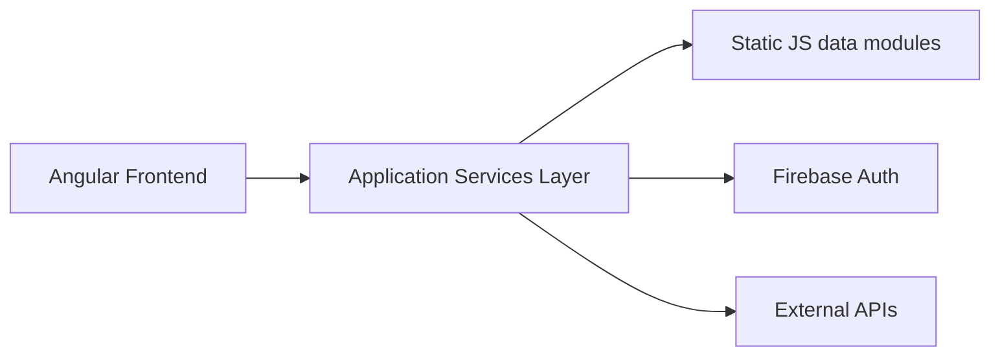

# C4 Architecture – Context & Container

## 1. System Context Diagram

```mermaid
flowchart LR
    User[Horgász felhasználó]
    PecaPont[PecaPont Web Application]
    External[Nyilvános horgászati adatforrások]
    Firebase[Firebase (Auth + DB)]

    User -->|HTTP / Browser| PecaPont
    PecaPont -->|adatlekérés| External
    PecaPont -->|auth / user adatok| Firebase
```

### Leírás

A rendszer elsődleges szereplője a horgász felhasználó, aki böngészőn keresztül éri el a PecaPont alkalmazást.

A PecaPont alkalmazás:

* külső adatforrásokból jelenít meg információkat (tavak, hírek, versenyek)
* Firebase szolgáltatáson keresztül kezeli a felhasználói autentikációt és adatokat

---

## 2. Container Diagram



### Konténerek

---

### Angular Frontend

A fő megjelenítési réteg.

Felelőssége:

* routing
* UI rendering
* komponensek kezelése
* felhasználói interakciók kezelése

---

### Application Services Layer

A frontend logika központi rétege.

Felelőssége:

* API hívások kezelése
* Firebase autentikáció integráció
* state kezelés
* role-based access control (RBAC)

---

### Static JS modulok

Jelenleg a domain logika és adatbetöltés egy része itt található:

* hirek.js
* tavak.js
* versenyek.js

---

### Firebase

Külső szolgáltatás:

* felhasználói autentikáció
* felhasználói adatok tárolása

---

### Külső adatforrások

Nyilvános horgászati API-k vagy statikus adatok.

---

## 3. Technológiai stack

* Angular
* TypeScript
* SCSS
* Firebase Authentication
* Static JavaScript modules
* GitHub repository
