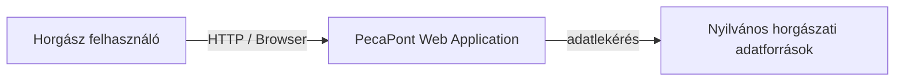
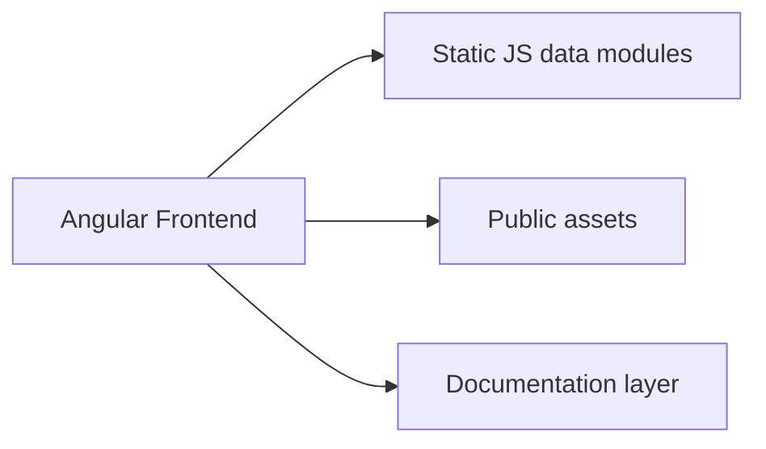

# C4 Architecture – Context & Container

## 1. System Context Diagram

### Leírás

A rendszer elsődleges szereplője a horgász felhasználó, aki böngészőn keresztül éri el a PecaPont alkalmazást.

A rendszer külső adatforrásokból jelenít meg híreket, tavakat és versenyeket.

---

## 2. Container Diagram

### Konténerek

### Angular Frontend

A fő megjelenítési réteg.

Felelőssége:

* routing
* UI rendering
* komponensek kezelése

---

### Static JS modulok

Jelenleg a domain logika és adatbetöltés egy része itt található:

* hirek.js
* tavak.js
* versenyek.js

---

### Dokumentációs réteg

A szakdolgozati és rendszer dokumentáció.

* product
* architecture
* quality
* AI docs

---

## 3. Technológiai stack

* Angular
* TypeScript
* SCSS
* Static JavaScript modules
* GitHub repository
